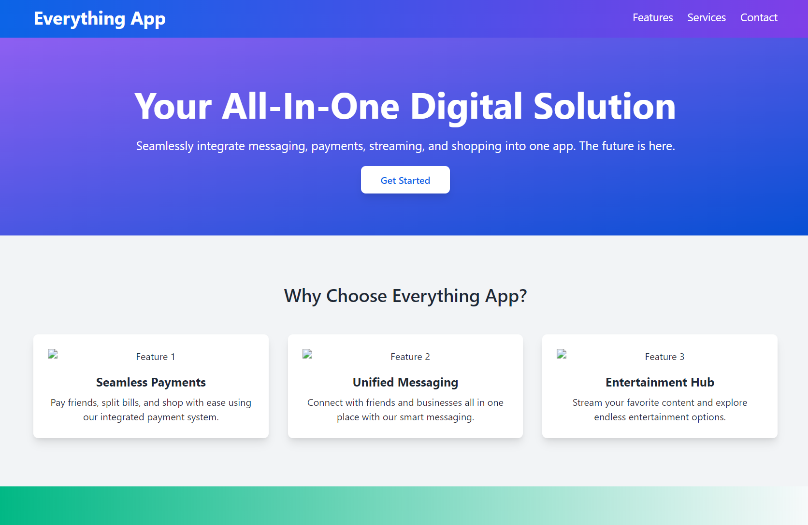
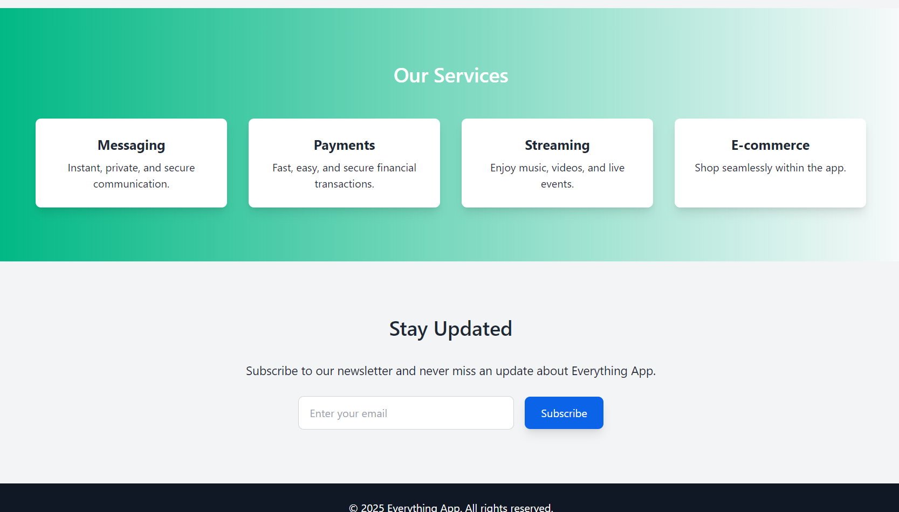

# 🏢 Everything App

A groundbreaking platform designed to revolutionize how you interact with the digital world. The Everything App combines payments, messaging, streaming, and e-commerce into one unified app, providing a seamless, efficient, and enjoyable experience.

**Everything App** is your one-stop solution for managing your daily digital needs. With a sleek design and a wide range of services, it ensures convenience and functionality in one place.

---

## 🔍 Key Features

- **Integrated Messaging**  
  Stay connected with friends, family, and businesses through a powerful messaging platform.

- **Payments Made Easy**  
  Pay bills, transfer money, and make purchases effortlessly with our secure payment system.

- **Stream & Chill**  
  Access your favorite music, videos, and live streams directly within the app.

- **Shop Seamlessly**  
  Browse and purchase products from multiple retailers, all in one place.

---

## 🔋 All-in-One Services

The Everything App is built to simplify your digital interactions by offering:

- **Unified Interface**: A single app to handle multiple services.
- **Customizable Experience**: Tailor the app to match your preferences.
- **Enhanced Security**: State-of-the-art encryption ensures your data remains private.
- **Cross-Platform Support**: Available on iOS, Android, and web platforms.

---

## 🔒 Privacy & Security

Your privacy and security are our top priorities:

- **End-to-End Encryption** for messaging and transactions.
- **Two-Factor Authentication** to safeguard your account.
- **Regular Updates** to ensure the app stays secure and functional.

---

## 📞 **Contact Us**

We'd love to hear from you! Whether you have a question, suggestion, or feedback, feel free to reach out:

- **Email**: [nszeeshankhalid@gmail.com](mailto:nszeeshankhalid@gmail.com)

---

## 💎 **Join the Revolution**

Be part of the future of digital convenience. Download the Everything App today and simplify your life!
